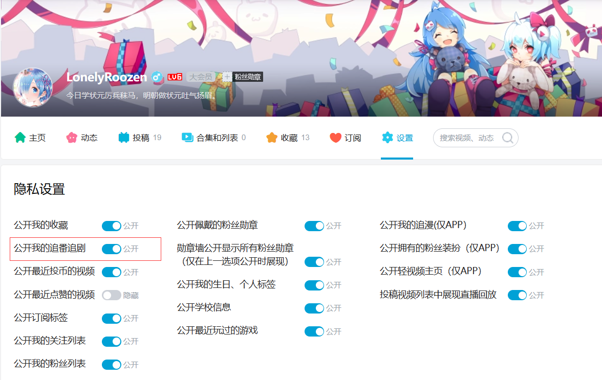

<h1 align="center">Halo 2.0 追番插件</h1>
<p align="center">
  <a href="https://github.com/halo-dev/halo"></a>
  <a href="https://github.com/liuzhihang/halo-theme-hao"></a>
  <a href="https://roozen.top"></a>
  <a href="./LICENSE"></a>
  <a href="https://github.com/Roozenlz/plugin-bilibili-bangumi/releases"></a>
</p>

Halo 2.0 的追番插件，支持在 Console 进行管理以及为主题端提供 `/bangumis` 页面路由。

> 本插件目前有[halo-theme-hao](https://github.com/liuzhihang/halo-theme-hao)、[halo-theme-aurora](https://github.com/Roozenlz/halo-theme-aurora)、[theme-clarity](https://github.com/acanyo/theme-clarity)主题支持

## 使用方式

1. 下载，目前提供以下下载方式：
    - GitHub Releases：访问 [Releases](https://github.com/Roozenlz/plugin-bilibili-bangumi/releases) 下载 Assets 中的 JAR 文件。
    - [Halo 应用市场](https://www.halo.run/store/apps/app-OTFPN)
2. 安装，插件安装和更新方式可参考：<https://docs.halo.run/user-guide/plugins>
3. 安装完成之后，访问 Console 左侧的**插件**菜单项打开**追番插件基本设置界面**，填写你的**bilibiliID**。

4. 前台访问地址为 `/bangumis`，需要注意的是，此插件需要**主题提供模板**（**bangumis.html**）才能访问 `/bangumis`。

> 注意，请打开以下开关！！！


本插件后续将支持**豆瓣源**，以及**自定义**追番信息(用于补充平台中没有的追番数据)，开源不易，喜欢请给个**star**，这是对我最大的鼓励！

## 开发环境

```bash
git clone git@github.com:halo-sigs/plugin-links.git

# 或者当你 fork 之后

git clone git@github.com:{your_github_id}/plugin-links.git
```

```bash
cd path/to/plugin-links
```

```bash
# macOS / Linux
./gradlew pnpmInstall

# Windows
./gradlew.bat pnpmInstall
```

```bash
# macOS / Linux
./gradlew build

# Windows
./gradlew.bat build
```

修改 Halo 配置文件：

```yaml
halo:
  plugin:
    runtime-mode: development
    classes-directories:
      - "build/classes"
      - "build/resources"
    lib-directories:
      - "libs"
    fixedPluginPath:
      - "/path/to/plugin-links"
```


## 主题适配
插件为主题端提供了 `/bangumis` 路由，模板为 `bangumis.html`。

### 模板变量
#### 路由信息

| 模板路径 | 访问路径 |
| --- | --- |
| `/templates/bangumis.html` | `/bangumis` |

#### 路由可选参数

| 参数名 | 描述 | 示例 |
| --- | --- | --- |
| `page` | 分页页码 | `/bangumis?page=1` 或 `/bangumis/page/1` |
| `typeNum` | 番剧类型（1.追番，2.追剧） | `/bangumis?typeNum=1` |
| `status` | 番剧状态（0.全部，1.想看，2.在看，3.已看） | `/bangumis?status=2` |
| `size` | 每页显示数量 | `/bangumis?size=20` |

#### 变量

| 变量名 | 类型 | 描述 |
| --- | --- | --- |
| `bangumis` | `BangumiListResult` | 追番列表数据，包含分页信息 |

#### 示例

```html
<ul>
    <li th:each="bangumi : ${bangumis.items}">
        
        <h3 th:text="${bangumi.spec.title}"></h3>
        <p th:text="${bangumi.spec.type}"></p>
        <p th:text="${bangumi.spec.area}"></p>
        <p th:text="${bangumi.spec.score}"></p>
    </li>
</ul>
<div th:if="${bangumis.hasPrevious() || bangumis.hasNext()}">
   <a th:href="@{${bangumis.prevUrl}}">
      <span>上一页</span>
   </a>
   <span th:text="${bangumis.page}"></span>
   <a th:href="@{${bangumis.nextUrl}}">
      <span>下一页</span>
   </a>
</div>
```

### Finder API

#### list(typeNum, status, page, size)

**描述**：根据分页参数获取番剧列表

**参数**
- `typeNum`：int - 番剧类型（1.追番，2.追剧）
- `status`：int - 番剧状态（0.全部，1.想看，2.在看，3.已看）
- `page`：int - 分页页码，从 1 开始
- `size`：int - 分页条数

**返回值**：`BangumiListResult`

**示例**

```html
<th:block th:with="bangumis = ${bangumiFinder.list(1, 0, 1, 10)}">
    <ul>
        <li th:each="bangumi : ${bangumis.items}">
            
        </li>
    </ul>
    <div>
        <span th:text="${bangumis.page}"></span>
    </div>
</th:block>
```

#### list({...})

**描述**：统一参数的番剧列表查询方法，支持分页、类型、状态等参数，且均为可选参数。

**参数**
- `params`：Map - 查询参数，包含：
  - `page`：int - 分页页码，从 1 开始（默认值：1）
  - `size`：int - 分页条数（默认值：10）
  - `typeNum`：int - 番剧类型（1.追番，2.追剧）（默认值：1）
  - `status`：int - 番剧状态（0.全部，1.想看，2.在看，3.已看）（默认值：0）

**返回值**：`BangumiListResult`

**示例**

```html
<ul th:with="bangumis = ${bangumiFinder.list({
  page: 1,
  size: 10,
  typeNum: 1,
  status: 2
})}">
    <li th:each="bangumi : ${bangumis.items}">
        <a th:href="${bangumi.spec.url}" th:text="${bangumi.spec.title}"></a>
    </li>
</ul>
```

#### getBiliData(typeNum, status, ps, pn)

**描述**：根据分页参数获取B站番剧数据

**参数**
- `typeNum`：int - 番剧类型（1.追番，2.追剧）
- `status`：int - 番剧状态（0.全部，1.想看，2.在看，3.已看）
- `ps`：int - 每页数量
- `pn`：int - 页码

**返回值**：`List<Bangumi>`

**示例**

```html
<ul>
    <li th:each="bangumi : ${bangumiFinder.getBiliData(1, 0, 10, 1)}">
        
    </li>
</ul>
```

#### getBiliDataAll(typeNum, status)

**描述**：获取所有B站番剧数据

**参数**
- `typeNum`：int - 番剧类型（1.追番，2.追剧）
- `status`：int - 番剧状态（0.全部，1.想看，2.在看，3.已看）

**返回值**：`List<Bangumi>`

**示例**

```html
<ul>
    <li th:each="bangumi : ${bangumiFinder.getBiliDataAll(1, 0)}">
        
    </li>
</ul>
```

### 类型定义

#### Bangumi

```json
{
  "spec": {
    "title": "string",                                  // 番剧名称
    "type": "string",                                   // 番剧类型
    "area": "string",                                   // 地区
    "cover": "string",                                  // 封面图片链接
    "totalCount": "string",                             // 总集数
    "id": "string",                                     // 番剧ID
    "follow": "string",                                 // 追番人数
    "view": "string",                                   // 播放量
    "danmaku": "string",                                // 弹幕数
    "coin": "string",                                   // 硬币数
    "score": "string",                                  // 评分
    "des": "string",                                    // 描述
    "url": "string"                                     // 番剧链接
  }
}
```

#### BangumiListResult

```json
{
  "items": [Bangumi],                                     // 番剧列表数据
  "page": 1,                                              // 当前页码
  "size": 10,                                             // 每页大小
  "total": 100,                                           // 总记录数
  "typeNum": 1,                                           // 类型编号
  "status": 0,                                            // 状态码
  "hasPrevious": true,                                    // 是否有上一页
  "hasNext": true,                                        // 是否有下一页
  "prevUrl": "/bangumis/page/1?typeNum=1&status=0",     // 上一页URL
  "nextUrl": "/bangumis/page/3?typeNum=1&status=0",     // 下一页URL
  "totalPages": 10                                        // 总页数
}
```
